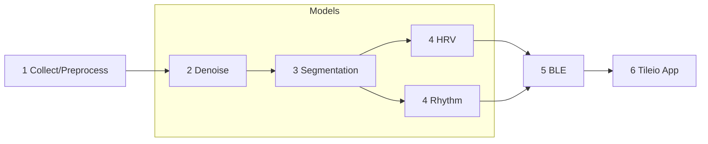
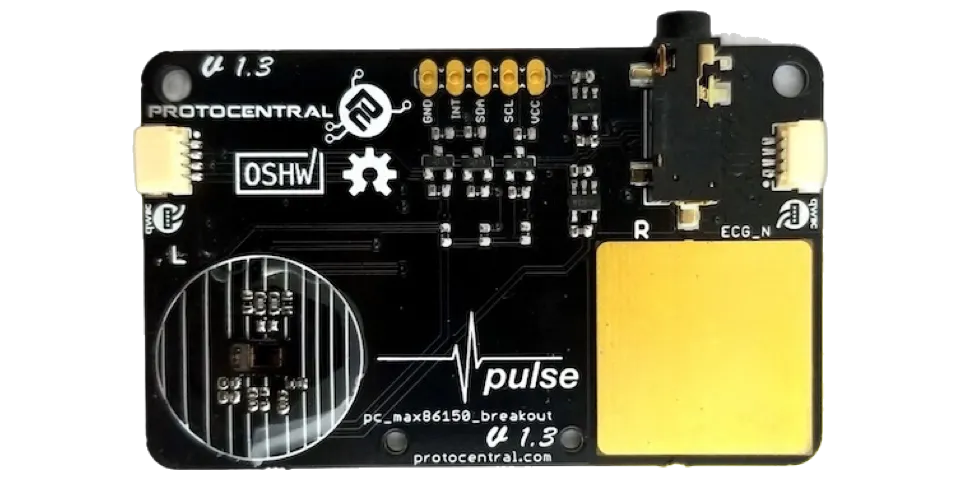
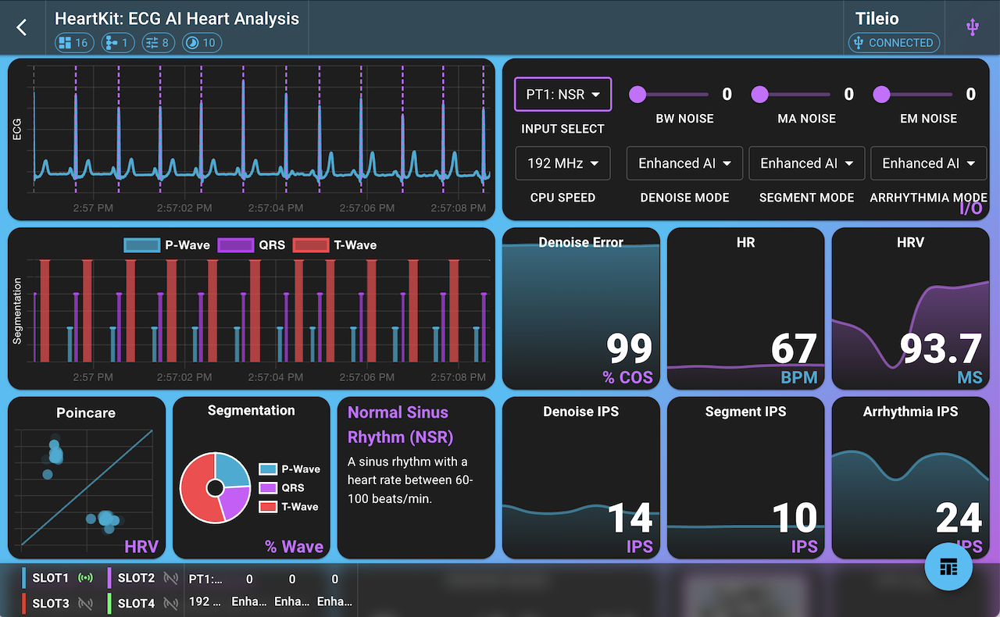

# :octicons-heart-fill-24:{ .heart } HeartKit: ECG AI Heart Analysis Demo

## Overview

The HeartKit: ECG AI Heart Analysis demo is a real-time, ECG-based heart analysis demonstrator that showcases several AI models trained using Ambiq's open-source HeartKit ADK. By leveraging a modern multi-head network architecture coupled with Ambiq's ultra low-power SoC, the demo is designed to be **efficient**, **explainable**, and **extensible**.

The demo consists of the following blocks:

* **Input Selection**: Select between subject data or live sensor data.
* **ECG Denoising**: Clean the ECG signal using either DSP or enhanced AI denoising.
* **ECG Segmentation**: Delineate the QRS complex, P-wave, and T-wave to identify heart rate metrics using either DSP or an enhanced AI segmentation model.
* **ECG Arrhythmia Detection**: Perform 4-class arrhythmia detection using an enhanced AI model.

In addition to selecting the input stream, the user is also able to adjust a number of other parameters, such as injecting noise, selecting AI modes, and adjusting the hardware such as clock speed.

In the first stage, 2 seconds of sensor data is collected- either from stored subject data or directly from the MAX86150 sensor. In stage 2, the ECG data is denoised and in stage 3 is segmented. In stage 4, the cleaned, segmented data is fed into the upstream blocks to compute HRV metrics along with arrhythmia detection using 10 seconds of data. Finally, in stage 5, the ECG data and metrics are streamed over BLE/USB to Tileio App to be displayed in a dashboard.

---

## Architecture

The HeartKit demo leverages a multi-head network- a backbone denoising and segmentation model followed by 2 upstream heads:

* [**Denoising model**](../assets/demos/heartkit/den-tcn-sm.json) utilizes a small 1-D TCN architecture to remove noise from the ECG signal.
* [**Segmentation model**](../assets/demos/heartkit/seg-4-tcn-sm.json) utilizes a small 1-D TCN architecture to perform ECG segmentation.
* [**Rhythm head**](../assets/demos/heartkit/arr-4-eff-sm.json) utilizes a 1-D MBConv CNN to detect 4-class arrhythmias.
* **HRV head** utilizes segmentation results to derive a number of useful metrics including heart rate and heart rate variability (HRV).

---

## Demo Setup

### Contents

The following items are needed to run the HeartKit demo:

* 1x Apollo4 Blue Plus EVB
* 1x MAX86150 Breakout Board
* 1x iPad or laptop w/ Chrome Browser
* 2x USB-C cables
* 1x Qwiic cable
* 1x USB-C battery pack for EVB (optional)

!!! note
    Please be sure to run the EVB from battery when using live sensor data. In addition, be sure to minimize surrounding EMI/RFI noise as the exposed sensor board's ECG pads are highly sensitive.

### Supported Platforms

The following Ambiq EVBs are currently supported by the demo. Be sure to set the **PLATFORM** variable to the desired value.

* **apollo4p_blue_kxr_evb** - [Apollo4 Blue Plus KXR SoC Eval Board](https://www.ambiq.top/en/apollo4-blue-plus-kxr-soc-eval-board):

### Flash Firmware

If using a fresh Apollo 4 EVB, the EVB will need to be flashed with the latest HeartKit firmware. The easiest option is to download the precompiled binary and flash via JFlashLite. This option is recommended for users who want to quickly load the existing firmware without compiling the code.

The only required tool is the J-Link software, which can be downloaded from the [SEGGER website](https://www.segger.com/downloads/jlink/). The J-Link software includes the JFlashLite tool, which is used to flash the firmware to the EVB.

1. :material-download: Download the firmware binary [heartkit.bin](../assets/demos/heartkit/heartkit.bin){:download="heartkit.bin"}.
2. :material-usb: Connect the EVB to your computer using a USB-C cable.
3. :material-rocket-launch: Launch JFlashLite tool.
4. :material-tune: Select the following options and press `OK`:
     * **Target Device**: `AMAP42KK-KBR`
     * **Target Interface**: `SWD`
     * **Speed**: `4000 kHz`
5. :material-file: Select **Data File** and browse for the downloaded firmware binary.
6. :simple-hexo: Set **Prog. Addr.** to `0x18000`.
7. :material-flash: Click `Program Device` to flash the firmware to the EVB.

For users who want to compile the firmware or to view the source code, please refer to the [Tileio Demos ➡ heartkit](https://github.com/AmbiqAI/tileio-demos/blob/main/heartkit/README.md).

### Hardware Setup

<figure markdown="span">
  { width="480" }
  <figcaption>MAX86150 Sensor Board</figcaption>
</figure>

In order to connect the MAX86150 breakout board to the EVB, we leverage the Qwiic connector on the breakout board. This will require a Qwiic breakout cable. For 3V3, use a jumper to connect Vext to 3V3 power rail. Then connect the cable as follows:

| Qwiic Cable  | EVB Board         |
| ------------ | ----------------- |
| Power (RED)  | VCC   (J17 pin 1) |
| GND (BLACK)  | GND   (J11 pin 3) |
| SCL (YELLOW) | GPIO8 (J11 pin 3) |
| SDA (BLUE)   | GPIO9 (J11 pin 1) |

---

## Run Demo

1. Connect the MAX86150 breakout board to the EVB using the Qwiic cable.

2. Plug the EVB into the computer/tablet using a USB-C cable. Optionally, power the EVB from a USB-C battery pack to avoid noise and ground loops. The latter requires connecting via BLE.

3. Launch Tileio app on your iOS device or go to [Tileio Web](https://ambiqai.github.io/tileio) using a Desktop Chrome browser.

4. If this is the first time using Tileio, you will need to add the HeartKit dashboard. Click on the "+" icon on the top right of the navigation bar. You can either select 'HeartKit Dashboard' from the built-in list or upload the latest configuration file ([hk-dashboard-config.json](../assets/demos/heartkit/hk-dashboard-config.json){:download="hk-dashboard-config.json"}).

5. Once the dashboard has been created, you can view the dashboard by clicking on the dashboard card.

6. To connect to a device, click on the `Select Device` in the top navigation bar. This will display a dialog to allow selecting a target device. Select the target interface **BLE** or **USB** (preferred) and click on "Scan". Select the target device from the list of available devices. Finally, click on the `Select` button to confirm the selection.

7. Once a device is selected, the dialog will display the device name and the connection status. To connect to the device, click on the `connect` button. After a successful connection, the connection status will change to `connected` and data will start streaming to the dashboard tiles. Click outside the dialog to close it.

8. After a few seconds, live data should start streaming to the Tileio app.

9. Use the "Input Select" to switch subject ECG input and "Noise Input" slider to inject additional noise.

<figure markdown="span">
  { width="768" }
  <figcaption></figcaption>
</figure>

## Dashboard Overview

The first row consists of two tiles: (1) the ECG signal and (2) the I/O controls tile. The I/O controls tile allows the user to select the input source, adjust noise levels, and select the AI modes. The input source consists of 5 subjects' pre-recorded ECG data containing different arrhythmia conditions. In addition, the user can select live sensor data from the connected MAX86150 sensor. There are three noise levels that can be adjusted: baseline wander (BW), muscle artifacts (MA), and electrode movement (EM). These are controlled via the three sliders from 0% to 100%. The I/O tile also allows the user to select the AI modes for denoising, segmentation, and arrhythmia detection. The choices include *Off*, *PhysioKit*, and *enhanced AI*. The *PhysioKit* option provides open-source, reference algorithms for the three blocks. The *enhanced AI* option provides a more advanced AI model for denoising, segmentation, and arrhythmia detection that were generated using Ambiq's HeartKit ADK.

The second row consists of the segmented ECG signal tile, denoise error tile, followed by the heart rate (HR) and heart rate variability (HRV) tiles. The segmented ECG signal tile displays the ECG signal with the QRS complex, P-wave, and T-wave segments highlighted. When *PhysioKit* is selected only QRS complexes are highlighted. The denoise error tile displays the cosine similarity between the raw and denoised ECG signals. The HR tile displays the heart rate in beats per minute (BPM) and the HRV tile displays the heart rate variability metrics.

The third row consists of the HRV Poincare plot tile, arrhythmia label tile, segmentation pie chart tile, followed by inferences per second tiles for denoising, segmentation, and arrhythmia detection blocks. The HRV Poincare plot tile plots the time delta between successive heartbeats in a scatter plot. The segmentation pie chart tile displays the percentage of time spent in each segment of the ECG signal. The arrhythmia label tile displays the detected arrhythmia class. The inferences per second tiles display the number of inferences per second for denoising, segmentation, and arrhythmia detection.

The fourth and final row consists of demo description tile, model complexity slides tile, HeartKit QR code tile, and lastly the CPU utilization tile. The model complexity slides tile displays the number of parameters, FLOPs, accuracy, inference time, inference power, and inferences per second per watt efficiency metrics for the denoising, segmentation, and arrhythmia detection models. The CPU utilization tile displays a coarse-grained view of the CPU utilization.

## Troubleshooting

If Tileio fails to connect to the EVB, please follow the steps below:

1. Ensure the EVB is powered on and connected to the computer/tablet via USB-C cable.
2. Ensure the EVB is running the latest HeartKit firmware.
3. If EVB is power cycled, please click `Forget Device` from Device dialog and repeat steps [6-7](#run-demo).

---
