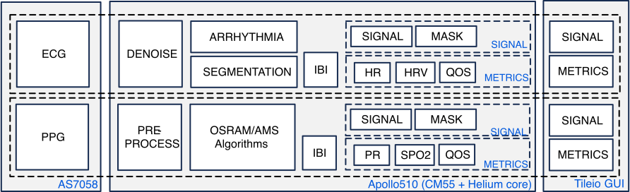
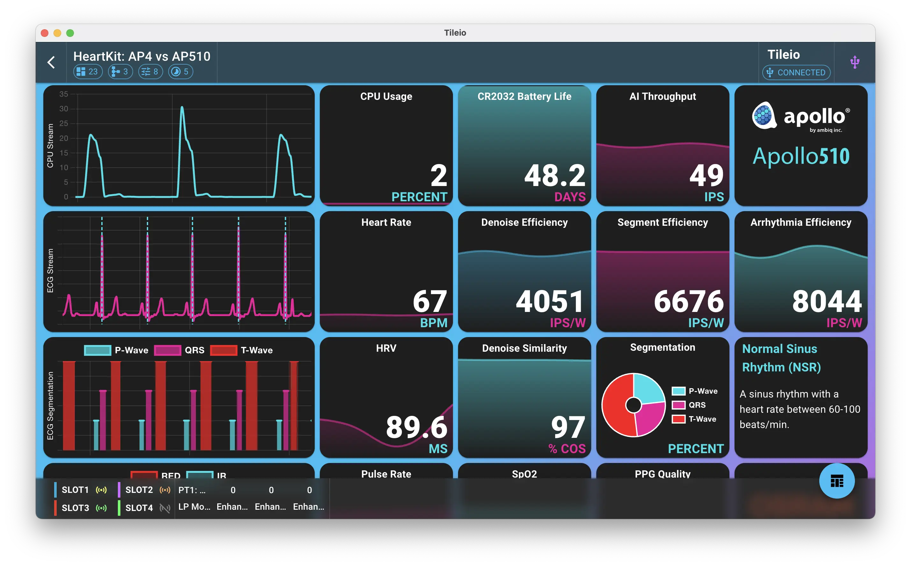

# :octicons-heart-fill-24:{ .heart } HeartKit: Vital Signs Monitoring Demo

## Overview

The HeartKit: Vital Signs Monitoring demo is a real-time vital sign monitoring system that showcases several AI models trained using Ambiq's open-source HeartKit ADK. By leveraging a modern multi-head network architecture coupled with Ambiq's latest ultra low-power Apollo510 SoC, the demo is designed to be **efficient**, **explainable**, and **extensible**. The demo also leverages AMS/OSRAM's powerful AS7058 vitals sensor to collect ECG and PPG signals.

The demo consists of the following blocks:

* **Input Selection**: Select between subject data or live sensor data via AS7058.
* **ECG Denoising**: Clean the ECG signal using enhanced AI denoising.
* **ECG Segmentation**: Delineate the QRS complex, P-wave, and T-wave to identify heart rate metrics.
* **ECG Arrhythmia Detection**: Perform 4-class arrhythmia detection using an enhanced AI model.
* **ECG Metrics**: Compute heart rate and heart rate variability metrics using the ECG segmentation results.
* **PPG Metrics**: Compute pulse rate and SpO2 metrics from the PPG signal using AMS/OSRAM algorithms.

In addition to selecting the input stream, the user is also able to adjust a number of other parameters, such as injecting noise, selecting AI modes, and adjusting the hardware such as clock speed.

---

## Architecture

The data processing pipeline is designed to be efficient and scalable, allowing for the addition of new AI models and metrics in the future. First, 2 seconds of ECG and PPG data is collected- either from stored subject data or directly from the AS7058 vital sensor. The ECG data is then fed into its own pipeline that consists of the following components:

1. **Denoising**: The ECG signal is denoised using either DSP filter or a small 1-D TCN architecture.
2. **Segmentation**: The denoised ECG signal is segmented using either DSP or a small 1-D TCN architecture. The DSP approach uses gradient-based thresholding to detect the QRS complex only.
3. **Arrhythmia Detection**: The segmented ECG signal is fed into a 1-D MBConv CNN to detect 4-class arrhythmias. If DSP is selected then a simple thresholding algorithm is used to determine bradycardia, tachycardia, and normal sinus rhythm classes only.
4. **IBI**: The segmentation results are used to compute heart rate and heart rate variability metrics from the inter-beat intervals (IBI).
5. **HR**, **HRV**, **Metrics**: Heart rate, heart rate variability, and arrhythmia detection results are streamed over USB to the Tileio App to be displayed in a dashboard.

Likewise, the PPG signal is processed in parallel to the ECG signal. The PPG signal is used to compute pulse rate and SpO2 metrics using AMS/OSRAM algorithms.

<figure markdown="span">
  { width="768" }
  <figcaption>High Level Overview</figcaption>
</figure>

The demo contains the following AI models:

* **Denoising model**: utilizes a small 1-D TCN architecture to remove noise from the ECG signal.
* **Segmentation model**: utilizes a small 1-D TCN architecture to perform ECG segmentation.
* **Arrhythmia model**: utilizes a 1-D MBConv CNN to detect 4-class arrhythmias.

---

## Demo Setup

### Contents

The following items are needed to run the demo:

* 1x [Ambiq Apollo510 EVB (Rev 2.1)](https://www.ambiq.top/en/apollo510-soc-eval-board)
* 1x [AMS/OSRAM AS7058 vitals sensor](https://ams-osram.com/products/boards-kits-accessories/kits/ams-as7058-evm-eb-evaluation-kit)
* 1x Laptop/PC with desktop Chrome browser
* 2x USB-C cables
* 1x Micro USB cable

!!! note
    Due to the sensitive nature of ECG signals, it is highly recommended to disconnect the laptop from AC mains and use battery power to avoid noise and ground loops. Be sure to also be in a quiet environment away from other electronic devices.

### Supported Platforms

The following Ambiq EVBs are currently supported by the demo.

* **apollo510_evb** - [Apollo510 SoC Eval Board](https://www.ambiq.top/en/apollo510-soc-eval-board)

### Flash Firmware

If using a fresh Apollo510 EVB, the EVB will need to be flashed with the latest firmware. The easiest option is to download the precompiled binary and flash via J-Link. This option is recommended for users who want to quickly load the existing firmware without compiling the code.

The only required tool is the J-Link software, which can be downloaded from the [SEGGER website](https://www.segger.com/downloads/jlink/). The J-Link software includes the JFlashLite tool, which is used to flash the firmware to the EVB.

1. :material-download: Download and extract zip file for target platform:
    * Apollo510 EVB: [ap510-hk-fw-rv301.zip](https://ambiqai-model-zoo.s3-us-west-2.amazonaws.com/demos/hk-vitals-demo/ap510-hk-fw-rv301.zip){:download="ap510-hk-fw-rv301.zip"}.
2. :material-usb: Connect a USB-C cable from your computer to MAIN_USB (J16) USB port on the Apollo510 EVB.
3. :material-usb: Connect a USB-C cable from your computer to USB_AP5 (J18) USB port on the Apollo510 EVB.
4. :material-power: Turn the EVB power on by setting switch SW4 to the ON position.
5. :material-flash: Once the EVB is powered on and recognized by your computer, run the script file suitable for your OS to flash the device (e.g. flash_linux.sh). This only needs to be done once.

### Hardware Setup

The Apollo510 EVB needs to be connected to the AS7058 EVM via SPI interface along with an interrupt signal.

Please use jumper wires to connect the following pins:

| SIGNAL NAME | AS7058 EVM | Apollo510 EVB |
| --- | --- | --- |
| SS | TH1.6 | GPIO60 |
| SCK | TH1.7 | GPIO47 |
| MOSI | TH1.8 | GPIO48 |
| MISO | TH1.9 | GPIO49 |
| GND | TH1.12 | GND |
| INT | TH2.5 | GPIO2 |

---

## Run Demo

1. Connect the EVB to your computer using a USB C port MAIN_USB (J16) USB on the EVB.
2. Connect the AS7058 EVM sensor board to your computer via the micro-USB port on the AS7058.
3. Turn on the AS7058 EVM by pressing the ON/OFF button for ~2 seconds.
4. Power on the Apollo510 EVB by setting switch SW4 to the ON position.
5. On your laptop, launch [Tileio Web App](https://ambiqai.github.io/tileio) using a Desktop Chrome browser.
6. On first time accessing the web app, you will need to create a new dashboard.
    1. Create a new dashboard by selecting the "+" button
    2. In the dialog, select the built-in dashboard "HeartKit: Vitals Monitoring".
    3. Select "Load" to create the dashboard.

7. On the main page, select the newly created dashboard card to view the dashboard page.
8. Next step is to connect the web app to the Apollo510 EVB via webUSB.
    1. Select the "Select Device" button in the top right of the navigation bar.
    2. In the Device Settings dialog, select "usb" interface and click the scan icon.
    3. The EVB should appear in the list of devices.
    4. Select the device and press the "Select" button to confirm.
    5. Finally, press the "Connect" button to establish a connection to the device.

9. After a few seconds, live data should start streaming to the Tileio app.

10. Use the "Input Select" to switch subject input along with the other input knobs to modify the processing pipeline.

## Dashboard Overview

<figure markdown="span">
  { width="768" }
  <figcaption>Tileio Dashboard</figcaption>
</figure>

The first row focuses on CPU usage and battery life. The first and second tile displays the CPU utilization of the entire application by leveraging FreeRTOS stats capabilities. The third tile displays the projected battery life when running on two CR2032 coin cells (500mAh) based on the current power consumption. The fourth tile displays the aggregated inferences per second throughput for all of the models running.

The second and third row focuses on the ECG signal processing pipeline. The second row contains the denoised ECG signal plot and the heart rate tile followed by the efficiency metric tiles of the three running models. The third row contains the outputs from the models. The first tile displays the segmented ECG signal plot. The second tile displays the heart rate variability (HRV) metric. The third tile displays the ECG denoising cosine similarity as a percentage. The fourth tile displays the segmentation pie chart breakdown. The fifth tile displays the classified arrhythmia label.

The fourth row focuses on the PPG signal processing pipeline. The first tile displays the two wavelength PPG signals: RED and IR. The second tile displays the pulse rate in beats per minute (BPM). The third tile displays the SpO2 percentage derived using AMS/OSRAM algorithms. The fourth tile displays the PPG signal quality also derived using AMS/OSRAM algorithms.

The fifth and final row primarily contains all of the I/O controls. The I/O controls tile allows the user to select the input source, adjust noise levels, and select the AI modes. The input source consists of 5 subjects' pre-recorded data containing different arrhythmia conditions. In addition, the user can select live sensor data from the connected AS7058 sensor. There are three noise levels that can be adjusted: baseline wander (BW), muscle artifacts (MA), and electrode movement (EM). These are controlled via the three sliders from 0% to 100%. The I/O tile also allows the user to select the AI modes for denoising, segmentation, and arrhythmia detection. The choices include *Off*, *DSP*, and *enhanced AI*. The *DSP* option provides open-source, reference algorithms for the three blocks using traditional DSP algorithms. The *enhanced AI* option provides a more advanced AI model for denoising, segmentation, and arrhythmia detection that were generated using Ambiq's HeartKit ADK.

## Troubleshooting

If Tileio fails to connect to the EVB, please follow the steps below:

1. Ensure the EVB is powered on and connected to the computer via USB-C cable.
2. Ensure the EVB is running the latest firmware.
3. If EVB is power cycled, please click `Forget Device` from Device dialog and repeat steps [8](#run-demo).

---
