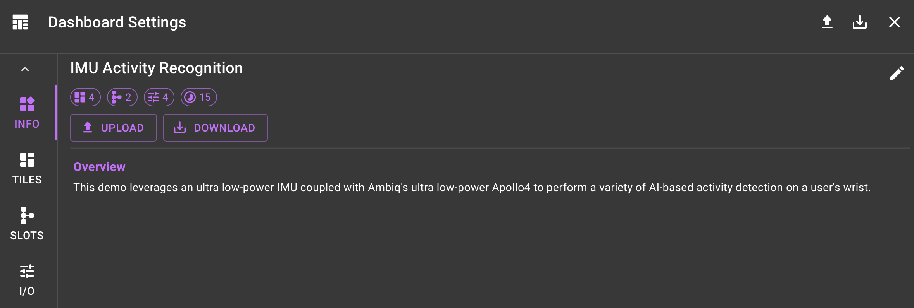
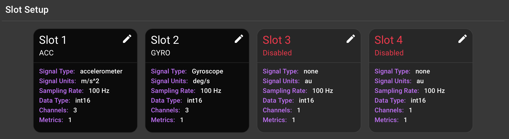

# New Dashboard Guide

## Overview
A dashboard contains everything needed to connect and display data from a device. The following options are available for creating a new dashboard:

1. **Built-in Dashboard**: A pre-configured dashboard with a set of tiles that display data from a device. Check out the [Built-in Demos](../demos/index.md) for more information.

2. **Upload Dashboard**: Several of the available demos have a pre-configured dashboard that can be uploaded as a json file. The json configuration file contains everything needed to recreate the dashboard. This is a convenient way to save snapshots as well as share dashboards with others.

3. **New Dashboard**: Create a new dashboard from scratch.

This guide will walk you through the process of creating a new dashboard from scratch.

## 1. Create Blank Dashboard

A new dashboard can be created by selecting the :material-plus-box: button in the navigation bar in the **Dashboards** page. This will present a dialog with three options for creating a new dashboard. In this case, select `New Dashboard`.

This will create a new dashboard with default settings and add a new dashboard card to the **Dashboards** page. To quickly modify the dashboard, select `Modify Dashboard` from the :material-dots-vertical: menu button of the card. If the dashboard is already displayed, you can modify the dashboard by clicking on the dashboard button in the top left of the navigation bar. Either of these options will present the `Dashboard Settings Dialog`.

The `Dashboard Settings Dialog` contains the following tabs:

* **Info**: The dashboard name and description.
* **Slots**: A set of slots that define the data streams from a device.
* **I/O**: A set of user input/output elements that can be used to interact with the device.
* **Tiles**: A set of tiles that display data from a device.

## 2. :material-widgets: Configure Dashboard Info

The first step in configuring a new dashboard is to set the dashboard name and description. This can be done by clicking on the dashboard button in the navigation bar and selecting the `Info` tab. The dashboard name and description will be displayed at the top of the dashboard. To edit the dashboard name and description, click on the `pencil` icon. To enable styling, the description accepts [markdown](https://www.markdownguide.org/basic-syntax/).

<figure markdown="span">
  { width="768" }
  <figcaption></figcaption>
</figure>

## 3. :fontawesome-solid-chart-bar: Configure Dashboard Slots

The next step is to configure the device slots. Click on the :fontawesome-solid-chart-bar: `Slots Tab`, to view and edit the slots. Recall that a slot consists of a set of simimilar signals captured at the same sampling rate.

For each required slot, click on the :material-pencil: `pencil` icon to edit the slot. The following fields need to be configured:

* **enabled**: A flag to indicate if the slot is enabled.
* **name**: The name of the slot (e.g. IMU).
* **units**: The units of the data being streamed (e.g. m/s^2).
* **fs**: The sampling rate of the data being streamed (e.g. 100 Hz). This is necessary to correctly estimate the time axis on the dashboard.
* **dtype**: The data type of the data being streamed (e.g. float32, int16).
* **chs**: A list of channel names (e.g. X, Y, Z).
* **metrics**: A list of metrics broadcasted by the device (e.g. e.g. fall).

<figure markdown="span">
  { width="768" }
  <figcaption></figcaption>
</figure>
