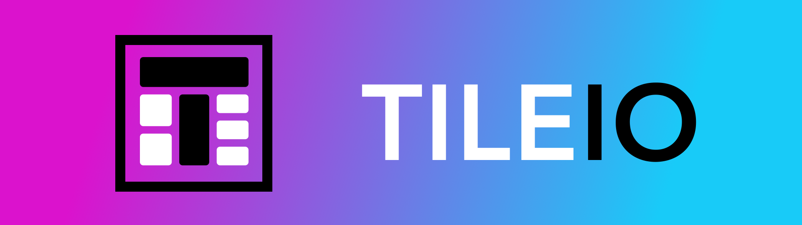
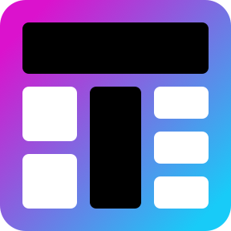
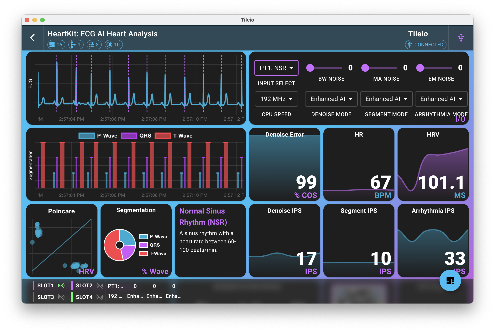

#

  

- :material-rocket-launch: [Getting Started](usage/index.md)
- :material-api: [API Documentation](api/index.md)
- :simple-docsdotrs: [Demo Examples](demos/index.md)
- :material-hexagon-multiple: [Explore Guides](guides/index.md)

Tileio is a powerful tool to create highly customizable dashboards for streaming real-time data from edge IoT devices. By leveraging a domain-agnostic API, along with highly customizable dashboard and tile configurations, Tileio can be used to create tailored demos for a wide range of applications from environmental monitoring to human activity recognition.

Tileio discovers and communicates to devices (e.g. Apollo4 Blue EVB) via **webBLE** or **webUSB**. A device streams data to Tileio through designated **slots**. At a high-level a **slot** consists of a set of similar signals (e.g. accelerometer) captured at the same sampling rate (e.g. 100 Hz). More specifically, a **slot** consists of two components: (1) a set of **channels** (e.g. X, Y, Z) along with a **mask** and (2) a set of **metrics**. A device can have up to 4 slots with each slot having up to 4 channels and up to 60 metrics.

Beyond streaming data, Tileio also provides a generic I/O (user input/output) interface that can be used to interact with the device. The I/O interface consists of 8 configurable I/O elements that be configured as a button, toggle switch, slider, or select box.

 

<figure markdown="span">
  { width="768" }
  <figcaption></figcaption>
</figure>
