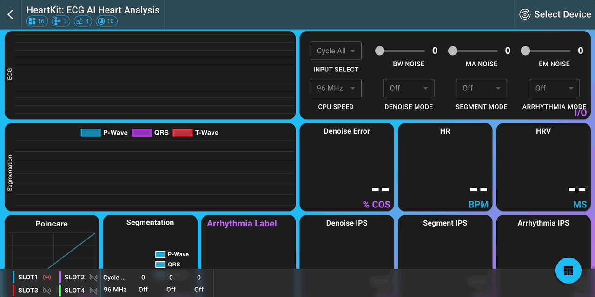

# :material-rocket-launch: Getting Started

## Installation

Tileio is available in three flavors: a native iOS/iPadOS app, an Android app, and a web-based app. The web-based app can be run on MacOS, Windows, Linux, as well as Android/ChromOS devices. The web-based app requires a browser that supports webUSB or webBLE. Chrome is the recommended browser.

### :fontawesome-brands-apple: iOS/iPadOS App

On iOS/iPadOS, Tileio is available as a native app on the App Store. The browser will not work as neither Safari nor Chrom provide support for webUSB or webBLE. The iOS/iPadOS app can also be run on MacOS.

Download the Tileio app from the [App Store](https://www.apple.com/app-store/tileio)

### :simple-android: Android App

On Android, Tileio is available as a native app on the Play Store. The web-based app can also be run on Android devices with a browser that supports webUSB or webBLE.

Download the Tileio app from the [Play Store](https://play.google.com/store/apps/details?id=com.ambiq.tileio)

### :material-google-chrome: Browser App

On MacOS, Windows, Linux, and Android/ChromOS devices, Tileio can be run in a browser that supports webUSB or webBLE. Chrome is the recommended browser.

Launch the Tileio app in your browser: [Tileio Web App](https://ambiqai.github.io/tileio/)

## Creating a Dashboard

The first time launching Tileio, you will need to create a new dashboard. The dashboard serves two purposes: (1) it provides a place to display data from a device and (2) it provides a place to configure the layout and appearance of the data.

To get started, launch Tileio and click on the `+` button. You will then be presented with a dialog that provides three options for creating a new dashboard:

1. **Built-in Dashboard**: A pre-configured dashboard with a set of tiles that display data from a device.
2. **Upload Dashboard**: Several of the available demos have a pre-configured dashboard that can be uploaded as a json file.
3. **New Dashboard**: Create a new dashboard from scratch. Refer to [New Dashboard Guide](../guides/new-dashboard.md) for more information.

Once the dashboard has been created, navigate to the dashboard by tapping on the dashboard card. The dashboard will be displayed with a set of tiles.

<figure markdown="span">
  { width="720" }
</figure>

## Connecting to a Device

Tileio can connect to a device via webBLE or webUSB. A **device** refers to an Ambiq evaluation board (e.g. Apollo4 Blue EVB) that is running a Tileio demo. The device must be powered on and in a state where it is advertising. For list of available demos, refer to [Demos](../demos/index.md). To get started creating a new demo, refer to [New Demo Guide](../guides/new-demo.md).

To connect to a device, click on the `Select Device` in the navigation bar. This will display a dialog to allow selecting a target device. First, you will need to perform the following steps to connect to a device:

1. Select the interface: `ble` or `usb`. Only supported interfaces will be displayed.
2. Select the scan buttoon to search for available devices.
3. Select the target device from the list of available devices.
4. Click on the `select` button to confirm the selection.

Once selecting a device, the dialog will display the device name and the connection status. To now connect to the device, click on the `connect` button. After a successful connection, the connection status will change to `connected` and data will start streaming to the dashboard tiles.

<figure markdown="span">
  { width="720" }
</figure>
